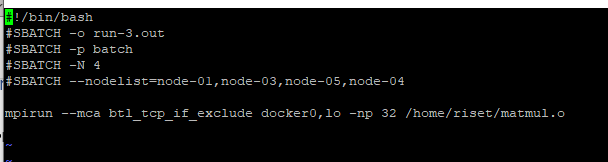
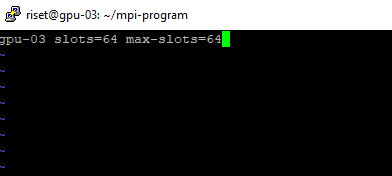

## Cluster Tutorial

 1 . Please access the cluster using ssh

```c
ssh user@ipaddress -p port
```

2 . Please open e.g matmul.c and edit your code. You can change your matrix size (N) Save it

```c
nano matmul.c
```

3 . Please compile your code `matmul.o`

```javascript
mpicc matmul.c -o matmul.o
```

4 . Please edit you run-script.sh.

*   Point the script to the matmul.o.
*   Set the name of your output file run-3.out.
*   Set your node list (1 node 8 cores)
*   Edit your -np to your preference number of your process. E.g 32 = 8 cores x 4 nodes

```c
nano run-script.sh
```

5 . Execute run-script.sh using this command

```c
sbatch run-script.sh
```

6 . Monitor your program using (R) Running (Q) Queue (C) Complete

```c
squeue-
```

7 . Open your run-3.out (Output file)

```c
nano run-03.out
```

---

## Multicore Tutorial

1 . Please access the cluster using ssh

```c
ssh user@ipaddress -p port
```

2 . Please open e.g matmul.c and edit your code. You can change your matrix size (N) Save it

```c
nano matmul.c
Ctrl + X
```

3 . Please compile your code matmul.o

```c
mpicc matmul.c -o matmul.o
```

4 . Please edit your hostfile

```c
nano hostfile
Ctrl + x
```

5 . Execute your code. Change the number of process -np between 2-64 and see your result.

```c
mpirun --hostfile hostfile -np 4 //matmul.o 
```

---

## GPU Cluster/ DGX Tutorial

1 . Please access the cluster using ssh

```c
ssh user@ipaddress -p port
```

2 . Please open and edit your yaml file.

```c
nano pods.yaml
Ctrl + X
```

3 . Please edit your name with this format {name}-gpuxx-{cudasdk-pods}

1.  Please edit your images : nvhpc21.9-devel-cuda, you can change this image based on requirement
    1.  CUDA : nvcr.io/nvidia/nvhpc:21.9-devel-cuda\_multi-ubuntu20.04
    2.  Tensorflow : nvcr.io/nvidia/tensorflow:20.08-tf2-py3
    3.  etc
2.  Edit your nodes : nodeSelector -à gpu-02 or gpu-03
3.  Edit your persistent storage to your user \<user01 – userxx>
4.  Apply your yaml file

```c
kubectl apply -f pods-working-ari.yaml
```

4 . Get information about your pods

```c
kubectl get pods
```

Description automatically generated with medium confidence\](img/009.png)

```c
Kubectl describe pods
```

5 . Access your pods

```c
kubectl exec -it /bin/bas
```

6 . Delete pods

```c
Kubectl delete pods
```

7 . Access your persistent storage in pods /var/nfs

1.  Use winscp and go to , protocol SCP/SFTP
2.  Enter username & password
3.  Place your code in your home directory
4.  \<your home directory in synchronize with /var/nfs folder in the pod

8 . Execute your code

```c
kubectl exec -it /bin/bash
cd /var/nfs/
nvcc matrix.cu -o matrix.o
./matrix.o
```